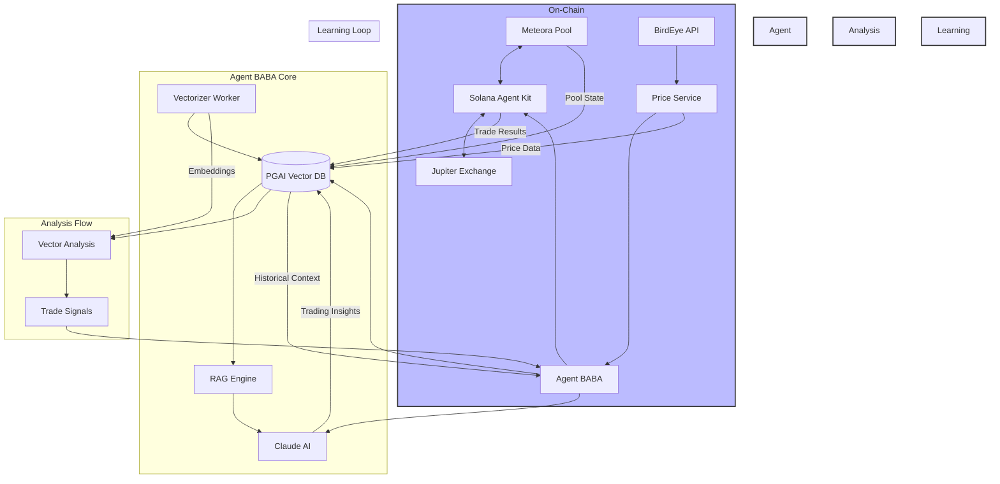

<p align="center">
  
</p>

## Agent BABA: Autonomous Solana Trading Agent with RAG-Enhanced Decision Making

[](https://opensource.org/licenses/MIT)
[](https://bun.sh/)
[](https://solana.com/)

### 🌟 Overview

Agent BABA is an innovative autonomous trading agent that operates on the Solana blockchain, specifically designed to optimize trading strategies for the $BABABILL token through Meteora liquidity pools. By combining the power of Retrieval Augmented Generation (RAG), pgAI vector embeddings, and autonomous decision-making capabilities, Agent BABA represents a new paradigm in on-chain trading automation.

### 🏗️ Architecture



### 🚀 Key Features

#### 1. Autonomous Trading

- Real-time monitoring of Meteora pools
- Automated micro-trading strategies
- Self-adjusting parameters based on market conditions
- Slippage protection and fail-safes
- Integrated BirdEye price feeds _(in progress)_

#### 2. RAG-Enhanced Decision Making

- Vector embeddings of historical trades using pgAI
- Semantic search with Ollama (all-minilm model)
- Automated vector updates via pgAI vectorizer
- Continuous learning from trade outcomes

#### 3. Advanced Analytics

- Real-time price impact analysis via BirdEye
- Liquidity depth monitoring
- Vector-based trade pattern analysis
- Historical trade pattern matching

### 🛠️ Technical Stack

- **Blockchain**: Solana
- **DEX Integration**: Meteora/Jupiter
- **Language**: TypeScript/Bun
- **AI**: Claude AI (Anthropic)
- **Vector Database**: PGAI with Ollama
- **Price Oracle**: BirdEye API
- **Server**: Hono
- **SDK**: Solana Agent Kit

### 📊 Data Flow

1. **Market Monitoring**

   - Real-time price tracking via BirdEye
   - Continuous monitoring of Meteora pool states
   - Transaction monitoring and vector analysis

2. **Trade Analysis**

   - Automated vector embedding (384 dimensions)
   - Semantic similarity search with proven accuracy
   - AI-powered outcome prediction
   - Risk assessment and optimization

3. **Execution**
   - Smart order routing via Jupiter
   - Slippage protection
   - Transaction verification
   - Automatic trade vectorization

### 💡 Innovation Highlights

- **Vector-Enhanced Trading**: Uses pgAI vectorizer for automated trade analysis
- **Autonomous Learning Loop**: Continuously improves trading strategies based on outcomes
- **Real-time Price Integration**: BirdEye API integration for accurate pricing
- **Micro-Trading Optimization**: Specialized in small, efficient trades

### 🔧 Installation

```bash
# Clone the repository
git clone https://github.com/yourusername/agent-baba.git

# Install dependencies
bun install

# Start the database and required services
docker compose up -d

# Pull required Ollama model
docker compose exec ollama ollama pull all-minilm

# Initialize the database
bun run init-db

# Start the agent
bun run dev
```

### 🌐 API Endpoints

- `GET /health` - Check agent status
- `GET /price` - Get current token price (BirdEye integration)
- `GET /estimate-trade` - Estimate trade outcome
- `GET /paper-trading/*` - Paper trading endpoints

### 🔒 Environment Variables

```env
HELIUS_RPC_URL=your_helius_url
CLAUDE_API_KEY=your_claude_key
BIRDEYE_API_KEY=your_birdeye_key
POSTGRES_HOST=localhost
POSTGRES_PORT=5432
POSTGRES_DB=agent_baba
POSTGRES_USER=postgres
POSTGRES_PASSWORD=postgres
```

### 📦 Docker Services

```yaml
services:
  db:
    image: timescale/timescaledb-ha:pg17
  vectorizer-worker:
    image: timescale/pgai-vectorizer-worker:latest
  ollama:
    image: ollama/ollama
```

### 👥 Team

Built with 💜 by Team BABABILL for the Solana AI Agent Hackathon

### 📄 License

MIT License - see LICENSE for details
